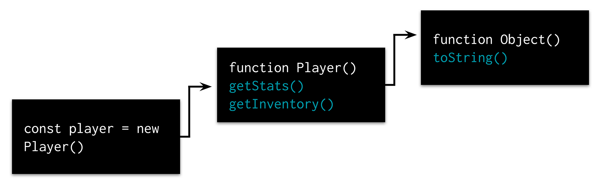

# 10.2

## 10.2.1 Introduction: Create a Player Object

-   Write constructor methods using JavaScript's prototype.
-   Write tests that verify proper method usage.
-   Mock a new Potion object upon creation of a Player object.

### Mocking

"faking" data to ensure that each test focuses on a singular purpose. Sometimes, constructors have other dependencies which aren't directly related to the feature you're testing.

## 10.2.2 Preview

Last lesson: `Potion()` constructor with `name` and `value` properties

### 10.2.2 Goals:

-   Create `Player()` constructor with `name` and `value`.
-   start player with two potions
-   write methods for the `Player` object to retrieve information about the player.

### Create Test for Player _Before_ Writing Constructor

```
test('creates a player object', () => {
    const player = new Player('Dave');

    expect(player.name).toBe('Dave');
    expect(player.health).toEqual(expect.any(Number));
    expect(player.strength).toEqual(expect.any(Number));
    expect(player.agility).toEqual(expect.any(Number));
});
```

-   you can test a single test by using `npm run test Player` or `npm run test Potion`.

## 10.2.4 Write a Player Constructor to Pass the Test

Test created to check for proper creation of a `Player` object. Now, write the constructor function.

code in `Player.test.js`:

```
const Player = require('../lib/Player');

test('creates a player object', () => {
    const player = new Player('Dave');

    expect(player.name).toBe('Dave');
    expect(player.health).toEqual(expect.any(Number));
    expect(player.strength).toEqual(expect.any(Number));
    expect(player.agility).toEqual(expect.any(Number));
});
```

code in `Player.js`:

```
function Player(name = '') {
    this.name = name;

    this.health = Math.floor(Math.random() * 10 + 95);
    this.strength = Math.floor(Math.random() * 5 + 7);
    this.agility = Math.floor(Math.random() * 5 + 7);
}

module.exports = Player;
```

-   ES6 allows you to set empty string if no `name` is provided.

## 10.2.5 Add Mock for Potion andRefactor Player Constructor

-   newly created players start with 2 potions
    -   call `new Potion()` from within the `Player()` constructor?
    -   NO. Preferable not to have constructors dependent on one another.
    -   If you needd to call an API to help, you wouldn't want API logic cluttering up constructor. Call API first, then pass the API data in as arguments.
-   we'll create a new `Potion` object within the `Player()` constructor.
    -   explore how to properly test a function that's dependent on another
    -   good tests run in isolation. If something is broken with `Potion()`, we only want it to affect that test suite, and not the `Player` test suite.

### Mocks

**Mocks** allow you to fake assumed data, which allows the test to focus on its logic alone.

-   create `lib/__mocks__` directory.
-   create `lib/__mocks__/Potion.js`
    -in `lib/__mocks__/Potion.js`, add code so it returns some values when running tests:

```
module.exports = function () {
	this.name = "health";
	this.value = 20;
};
```

-   add code to `Player.test.js`:

```
const Potion = require('../lib/Potion');

jest.mock('../lib/Potion');
```

-   `require()`
    -   imports `Potion()` constructor into the test
    -   gives variables to `Potion` so it doesn't throw an error
-   `jest.mock()`

    -   mocks/replaces the constructor's implementation with our faked data.
    -   if `new Potion()` is ever called within the test file itself or _any_ of subsequent modules attached to the test, mocked data will be returned

-   refactor player test to check for the creation on an inventory: ??? Not sure what this is for?

```
expect(player.inventory).toEqual(
  expect.arrayContaining([expect.any(Object)])
);
```

`this.inventory = [new Potion('health'), new Potion()];`

## 10.2.6 Write Failing Testsfor getStats and getInventory

-   print player's stats after they use potion/receive damage
-   set up in a way it's reusable in another game

```
const player = new Player('Jane);

player.getStats();
player.getInventory();
```

### Create Tests

```
test("gets player's stats as an object", () => {
	const player = new Player('Dave');

	expect(player.getStats()).toHaveProperty('potions');
	expect(player.getStats()).toHaveProperty('health');
	expect(player.getStats()).toHaveProperty('strength');
	expect(player.getStats()).toHaveProperty('agility');
});
```

## 10.2.7 Write getStats and getInventory Methods to Pass Test

Now that we have constructor functions, where do you define the methods? Two options:

### (Undesirable) Option 1 for defining methods: use the same `this` keyword

-   create `getStats()` and `getInventory()` method on every `Player` object that's created
-   Even though `this.methodName` looks clearer, it creates new methods for _each_ player. Problematic with many players.
-   When using **Prototype Chain** with `prototype` (option 2 below) - new `player` objects inherit the method from the constructor, they don't have their own instances of the method. - you create the method once on the constructor itself. - This inheritance can traverse multiple levels. If the method being called doesn't exist on `Player()`, JS will look for it on the next constructor up the chain
    -   you can call `player.toString()` even though it's not explicitly defined anywhere. It is inherited from `Object` two levels up.
        

```
function Player(name = '') {
  this.name = name;

  this.health = Math.floor(Math.random() * 10 + 95);
  this.strength = Math.floor(Math.random() * 5 + 7);
  this.agility = Math.floor(Math.random() * 5 + 7);

  this.inventory = [new Potion('health'), new Potion()];

  // OPTION 2 WITH PROTOTYPE CHAIN. USE THIS METHOD

Player.prototype.getStats = function() {
  return {
    potions: this.inventory.length,
    health: this.health,
    strength: this.strength,
    agility: this.agility
  };
};

Player.prototype.getInventory = function() {
  if (this.inventory.length) {
    return this.inventory;
  }
  return false;
};
```

**OPTION 1 CODE BELOW, _DON'T_ DO IT THIS WAY**

```
  // returns an object with various player properties
  this.getStats = function() {
    return {
      potions: this.inventory.length,
      health: this.health,
      strength: this.strength,
      agility: this.agility
    };
  };

  // returns the inventory array or false if empty
  this.getInventory = function() {
    if (this.inventory.length) {
      return this.inventory;
    }
    return false;
  };
}
```

### A Warning About ES6 Arrow Functions

-   arrow functions change what `this` means
    -   arrow functions bind `this` to the parent lexical scope _instead of_ the scope of the method.

|         | Normal Lexical Scope Conditions     | Arrow Functions                                                                                                           |
| ------- | ----------------------------------- | ------------------------------------------------------------------------------------------------------------------------- |
| scope   | within the scope of the method      | scope binded to _parent_ lexical scope                                                                                    |
| Node.js | self-references the `Player` object | `this` refers to whatever it means in outer scope. In Node.js, `this` is an empty object (`{}`), and therefore undefined. |

### Quiz Questions:

#### What’s the best way to add a method to a constructor function?

-   Car.prototype.honk = function( ) { }
    -   YES. Allows new `car` objects to inherit the method from the constructor.
-   Car.honk = function( ) { }
    -   This would attach the method to the `Car` function only, meaning you could only call it with `Car.honk()`
-   Car.prototype.honk = ( ) => { }
    -   arrow syntax would break the scope of `this` inside the method
-   this.honk = function( ) { } - incorrect
    -   It would work, but would create a new function for every `Car` object that's created

#### If you want to mock a module located at ./utils/hello.js, where would you create the mock file?

-   `./utils/hello.mock.js`
    -   Jest looks for folder named `mocks`, not a file named `mock`
-   `./__mocks__/hello.js`
    -   This would only work if `hello.js` was also in the root directory of your project
    -   ??? I thought this one was correct
-   `./__tests__/__mocks__/hello.js`
    -   mocks don't go inside same directory as the tests
-   `./utils/__mocks__/hello.js`
    -   YES: Mocks go inside a `__mocks__` folder located in the same directory as the module you're mocking.
